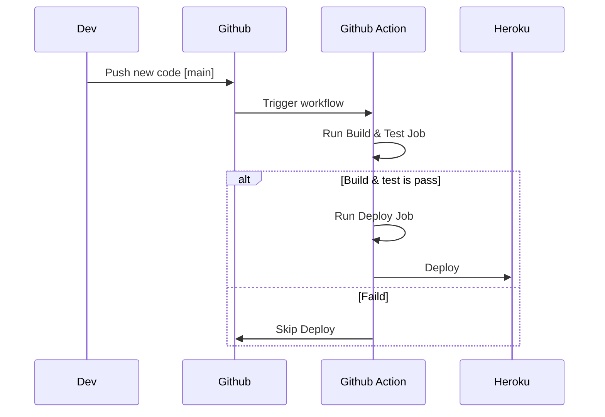
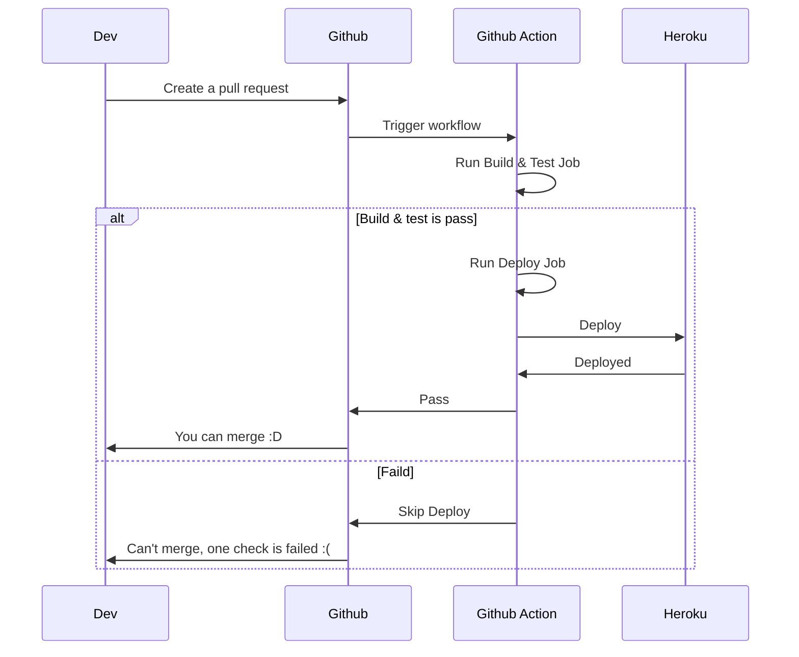

# Github Action Zero to Zero point one!

Push to main branch flow

Create a pull request flow

In this flow, you need to go to Github repository and add some configuration there
- set [Require status checks to pass before merging.](https://docs.github.com/en/repositories/configuring-branches-and-merges-in-your-repository/defining-the-mergeability-of-pull-requests/managing-a-branch-protection-rule)
- Can't see the name of check? please check out [this](https://stackoverflow.com/questions/68554735/github-action-status-check-missing-from-the-list-of-checks-in-protected-branch-s#comment123779008_68613319)
            
