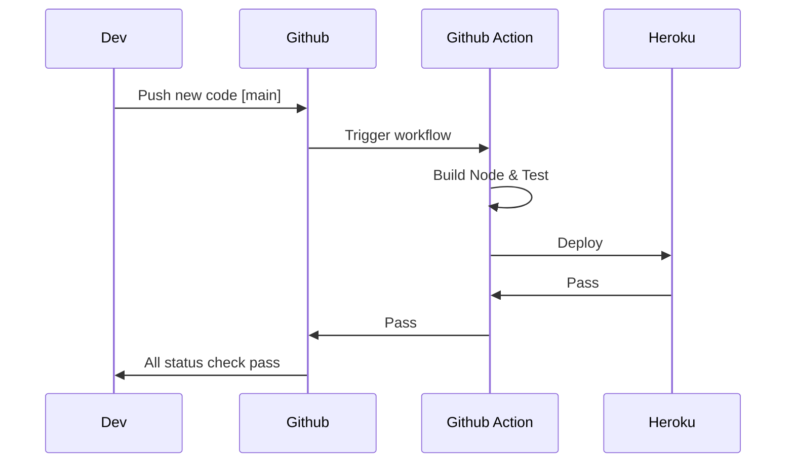

# Github Action Zero to Zero point one!

```mermaid
sequenceDiagram
    Dev->>Github: Push new code [main]
    Github->>Github Action: Trigger workflow
    Github Action->>Github Action: Build Node & Test
    Github Action->>Heroku: Deploy
    Heroku->>Github Action: Pass
    Github Action->>Github: Pass
    Github->>Dev: All status check pass
```
            
